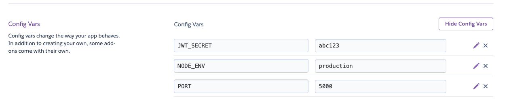

## Deployment

### Project URL:
https://comp3120-shopology.herokuapp.com

### Basic requirements

1. Build optimized version for front-end

```
cd client
npm run build
```

2. Push to Heroku

There is a Heroku postbuild script, so if you push to Heroku, no need to build manually for deployment to Heroku.

> **heroku-postbuild** script in package.json will tell Heroku to run after it install dependencies.

```
" set the name for your project
heroku create <Your project's name>

# Refer the Deploy script on Heroku website

" when ever you want to push your change to the actualy website on heroku.
git push heroku master
```

### Setting Config vars on Heroku

We must not push .env but instead using Config Vars in setting section on Heroku to config environment variables. For example:  

